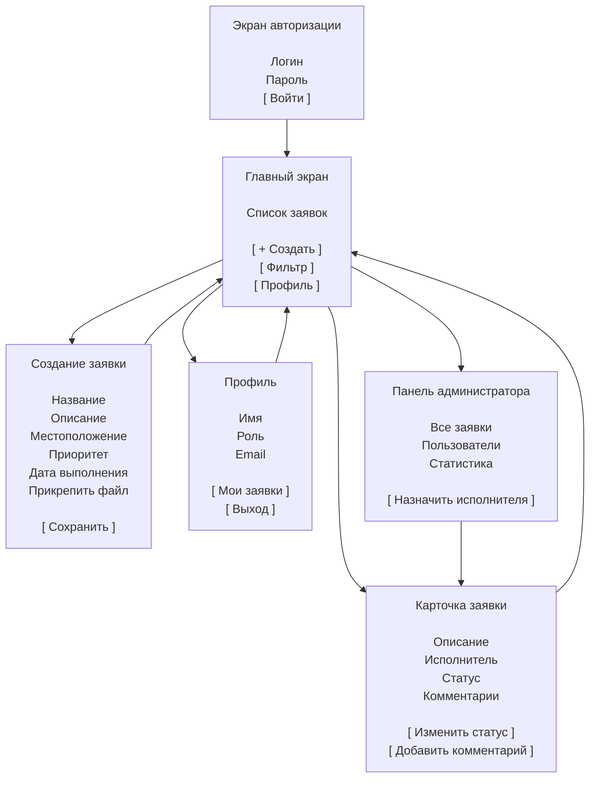

# Прототип мобильного приложения FixIt Service

## Описание

Прототип интерфейса мобильного приложения **FixIt Service** предназначен для демонстрации основных пользовательских сценариев:

- авторизация;
- просмотр заявок;
- создание заявки;
- просмотр деталей заявки;
- управление пользователем и заявками.

---

## Схема экранов

---

## Описание переходов

### Экран авторизации

После успешного ввода учетных данных пользователь переходит на главный экран приложения.

### Главный экран

Доступны следующие действия:

- просмотр списка заявок;
- переход к созданию новой заявки;
- открытие профиля;
- переход к карточке заявки.

### Создание заявки

Пользователь заполняет:

- название проблемы;
- описание;
- местоположение;
- приоритет;
- срок выполнения;
- вложения.

После сохранения происходит возврат на главный экран.

### Карточка заявки

Позволяет:

- просматривать детали;
- изменять статус;
- добавлять комментарии.

### Панель администратора

Доступна инженеру и системному администратору.

Позволяет:

- просматривать все заявки;
- назначать исполнителей;
- управлять пользователями;
- просматривать статистику.
